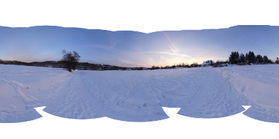
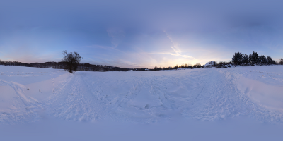

# panofill

Das Kommandozeilenwerkzeug `panofill` ist ein Programm zur automatischen Vervollständigung sphärischer 360°×180°-Panoramabilder, das die Eigenschaften dieser Projektion berücksichtigt.

## Zielsetzung

Ziel des Projektes ist es, ein für Stapelverarbeitungszwecke geeignetes plattformunabhängiges Programm bereitzustellen, das sich perfekt in den Arbeitsablauf bei der Panoramaerzeugung einfügt.

## Plattform

`panofill` benutzt außer libtiff, getopt und gettext ausschließlich die C++-Standardbibliothek und sollte deshalb auf jedem hinreichend leistungsfähigen Rechner kompilierbar sein, für den ein GNU-C++-Compiler verfügbar ist. Die Verwendung eines anderen C++-Compilers ist ebenfalls denkbar.

## Aktuelle Funktionsweise

Das Programm arbeitet mit einer an die sphärische Projektion angepassten Gaußpyramide. Die Anpassungen betreffen eine variable in Polnähe ansteigende Weichzeichnerbreite und das Verhalten an den Bildrändern.

- TIFF-Datei lesen
- Gleitkommadarstellung des Bildes erzeugen _(Ebene 0 der Gaußpyramide)_
  - Nächste Gaußpyramidenebene erzeugen; Alphakanal dabei mit Obergrenze mit einem festen Wert multiplizieren
  - Rekursionstiefe erhöhen, falls die oberste Gaußpyramidenebene noch transparente Pixel enthält
  - Die zweitoberste Ebene mit der obersten überblenden und die oberste löschen
- 32-Bit-Darstellung _(Rot, Grün, Blau und Alpha mit je 8 Bit)_ aus Ebene 0 erzeugen
- Ergebnis in TIFF-Datei speichern

## Perspektiven

Mögliche zukünftige Erweiterungen schließen Technologie aus dem Bereich der Textursynthese ein. Denkbar ist z.B. die Verwendung stochastischer Textursynthese zur Simulation zufälliger oder zufallsähnlicher Effekte wie Sensorrauschen, Asphalt, Schnee, Wolken, Gras usw.
